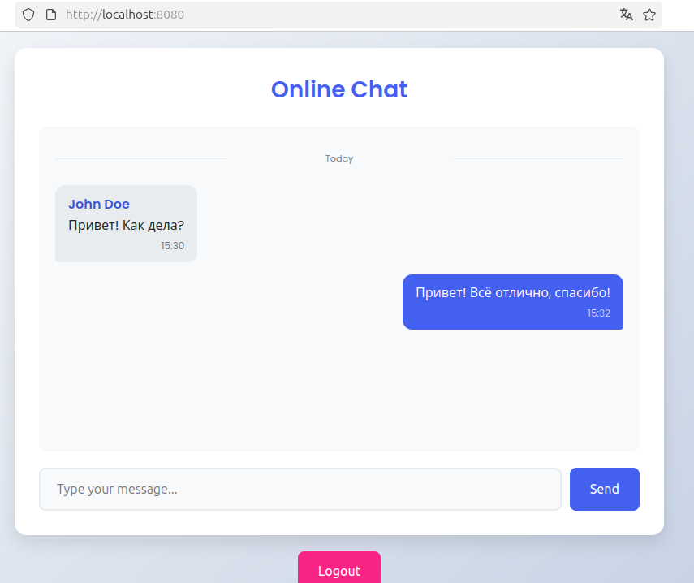
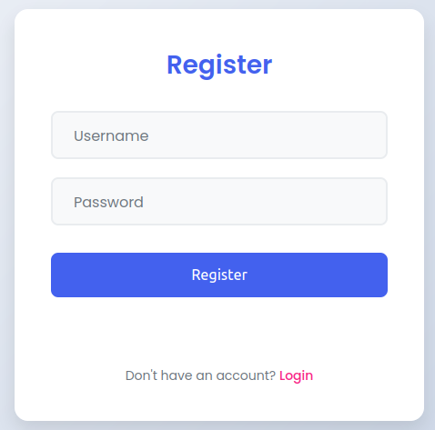
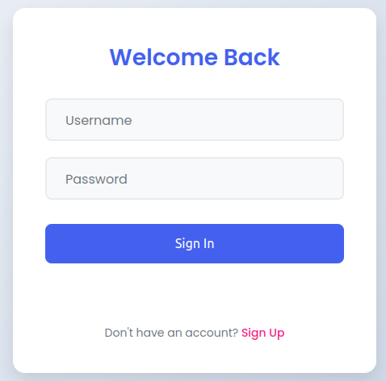
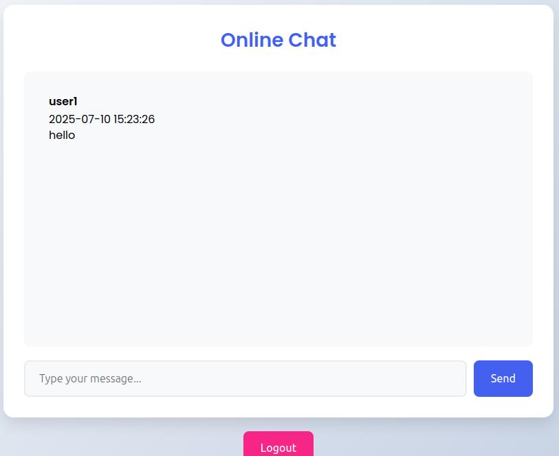

# 🚀 Online Chat - Учебный проект

## Простой веб-чат с аутентификацией, созданный в учебных целях для освоения современных веб-технологий.

*Разработан в рамках учебного проекта в МИИГАиК*

### 🛠 Технологии
[](https://isocpp.org/) 
[](https://crowcpp.org)

### 🗄 База данных
[](https://sqlite.org)

### 🔐 Безопасность
[](https://jwt.io)







## 📌 О проекте

Это учебное приложение демонстрирует:

- Работу с веб-сокетами в реальном времени
- JWT аутентификацию
- REST API архитектуру
- Взаимодействие фронтенда и бэкенда
- Основы безопасности веб-приложений

## 🛠 Технологии

**Frontend:**
- HTML5
- JavaScript (ES6+)
- Fetch API для HTTP-запросов

**Backend:**
- C++ (crow framework)
- SQLite для хранения данных
- JWT для аутентификации

## 🚀 Запуск проекта

## Клонировать репозиторий:
```
git clone [https://github.com/Giffulf/online_chat.git]
```
## Собрать и запустить проект и сервер:
```
cd online_chat
mkdir build && cd build
cmake ..
make
./online_chat
```
## Открыть в браузере:
```
http://localhost:8080
```
## 🔒 Учетные данные для теста

| Логин       | Пароль               |
|-------------|----------------------|
| user1       | password1            |
| user2       | password2            |

## 📚 Чему я научилась
- Реализация RESTful API
- Работа с JWT токенами
- Хеширование паролей
- Организация структуры проекта
- Обработка ошибок на клиенте и сервере

📝 Лицензия

Этот проект создан исключительно в учебных целях. Использование кода разрешено для обучения и некоммерческого использования.

*Учебный проект © 2025 | [МИИГАиК]*